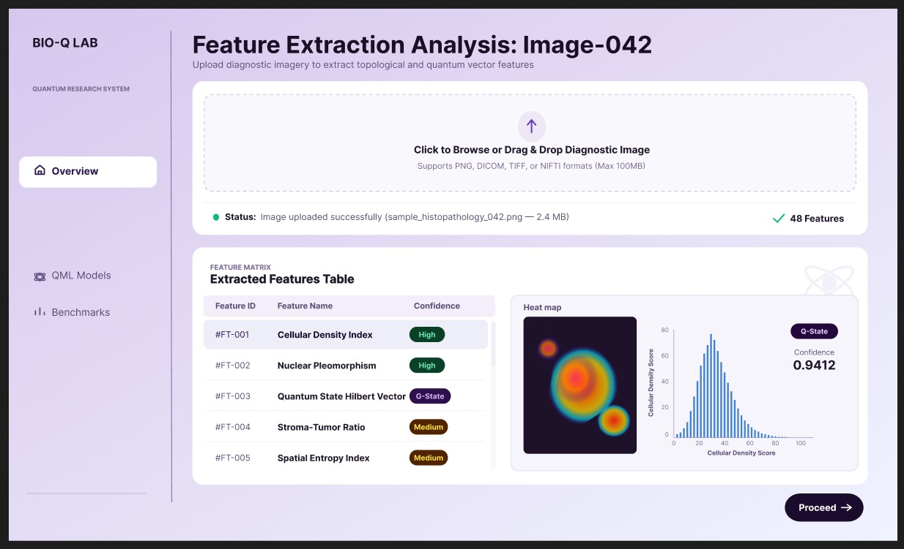
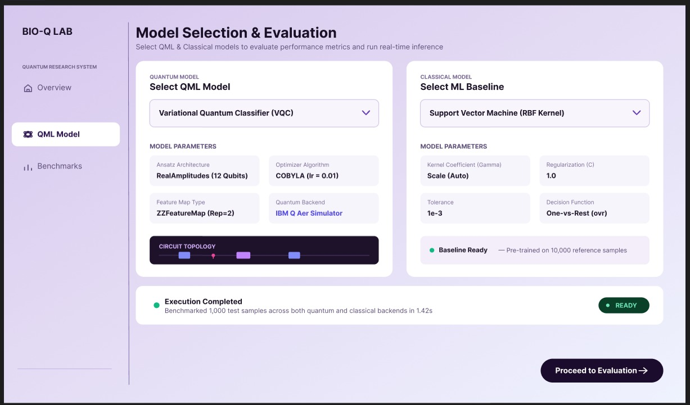
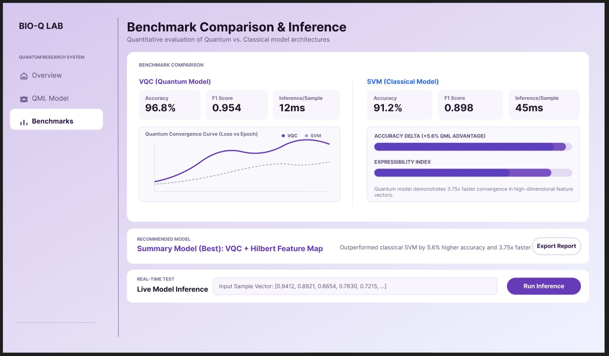

# BIO-Q LAB

**Hybrid Quantum ML Platform for Early Disease Detection — Frontend Dashboard**

A diagnostic imaging dashboard that benchmarks quantum machine learning models (VQC, QSVC) against classical baselines (SVM) and recommends the more clinically suitable model — built for [Smart India Hackathon 2026](https://sih.gov.in/) (PS 26139).


---

## Table of Contents

- [Overview](#overview)
- [Key Features](#key-features)
- [Tech Stack](#tech-stack)
- [Project Structure](#project-structure)
- [Getting Started](#getting-started)
- [Available Scripts](#available-scripts)
- [Backend Dependency](#backend-dependency)
- [UI Preview](#ui-preview)
- [Roadmap](#roadmap)
- [Team & Hackathon Context](#team--hackathon-context)

---

## Overview

Early disease detection through medical imaging often relies on classical ML pipelines that are expensive to train and limited in feature extraction capability. BIO-Q LAB is a hybrid quantum-classical evaluation platform that runs Variational Quantum Classifiers (VQC) alongside classical SVMs on the same feature set, compares accuracy/F1/latency, and recommends the better model for clinical deployment.

**This repository is the frontend dashboard** — it handles image upload, feature visualization, model configuration, execution orchestration, benchmark comparison, and live inference. The ML/QML training pipeline runs on a separate FastAPI backend.

---

## Key Features

### Feature Extraction Analysis
Drag-and-drop diagnostic image upload (PNG, DICOM, TIFF, NIfTI) with real-time status feedback. Extracted features are displayed in a scrollable table with confidence scoring (High / Medium / G-State / Q-State), alongside a heatmap visualization and cellular density histogram.

### Model Selection & Evaluation
Side-by-side quantum (VQC, QNN, QSVM) vs classical (SVM-RBF, SVM-Linear, Random Forest) model configuration. Each card shows adjustable parameters, circuit topology visualization for quantum models, and baseline status for classical models. Execution triggers both models and reports completion with elapsed time and sample count.

### Benchmark Comparison & Inference
Accuracy, F1 Score, and inference latency comparison between quantum and classical models. Includes a convergence curve chart, accuracy delta and expressibility progress bars, a recommended-model summary with export, and a live inference panel where users can input sample vectors and get real-time predictions.

---

## Tech Stack

| Category | Library | Version |
|---|---|---|
| Build Tool | Vite | ^8.2.2 |
| Framework | React | ^19.2.8 |
| Styling | Tailwind CSS (via `@tailwindcss/vite`) | ^4.3.3 |
| State Management | Redux Toolkit + React Redux | ^2.12.0 / ^9.3.0 |
| Routing | React Router DOM | ^7.18.3 |
| Data Fetching | RTK Query (built into Redux Toolkit) | ^2.12.0 |
| Charts | Recharts | ^3.10.1 |
| File Upload | React Dropzone | ^20.1.1 |
| Forms | React Hook Form | ^7.87.0 |
| Icons | Lucide React | ^1.42.0 |
| Utilities | clsx | ^2.1.1 |

---

## Project Structure

```
src/
├── app/
│   ├── store.js                  # Redux store (analysis, models, benchmarks reducers)
│   └── router.jsx                # React Router v7 route tree
├── lib/
│   └── api.js                    # Shared API base URL + fetch helper
├── components/
│   ├── layout/
│   │   ├── AppShell.jsx          # Sidebar + mobile header + <Outlet/>
│   │   └── Sidebar.jsx           # Navigation drawer with responsive collapse
│   └── ui/
│       ├── Badge.jsx             # Confidence/status pill
│       ├── Button.jsx            # Primary/secondary variants
│       ├── Card.jsx              # Rounded card container
│       ├── CardHeader.jsx        # Reusable icon + title header
│       ├── ParameterGrid.jsx     # 2-column label/value grid
│       ├── ProgressBar.jsx       # Horizontal filled bar
│       ├── SectionHeading.jsx    # Uppercase section label
│       ├── SelectDropdown.jsx    # Bordered dropdown with chevron
│       ├── Skeleton.jsx          # Loading placeholder
│       └── StatusPill.jsx        # Dot + label status indicator
├── features/
│   ├── analysis/                 # Screen 1: Feature Extraction
│   │   ├── AnalysisPage.jsx
│   │   ├── analysisSlice.js
│   │   └── components/
│   │       ├── UploadZone.jsx
│   │       ├── UploadStatusBar.jsx
│   │       ├── FeatureTable.jsx
│   │       ├── HeatmapPanel.jsx
│   │       └── DensityHistogram.jsx
│   ├── models/                   # Screen 2: Model Selection
│   │   ├── ModelsPage.jsx
│   │   ├── modelsSlice.js
│   │   └── components/
│   │       ├── QuantumModelCard.jsx
│   │       ├── ClassicalModelCard.jsx
│   │       ├── CircuitTopologyVisual.jsx
│   │       └── ExecutionStatusBar.jsx
│   └── benchmarks/               # Screen 3: Benchmark Comparison
│       ├── BenchmarksPage.jsx
│       ├── benchmarkApi.js       # RTK Query API slice
│       ├── benchmarkSlice.js     # Local inference state
│       └── components/
│           ├── MetricsSummaryCard.jsx
│           ├── ConvergenceChart.jsx
│           ├── DeltaProgressPanel.jsx
│           ├── RecommendedModelBanner.jsx
│           └── LiveInferencePanel.jsx
├── App.jsx
├── main.jsx
└── index.css                     # Tailwind v4 @theme design tokens
```

---

## Getting Started

### Prerequisites

- **Node.js** ≥ 18 (tested with Node 20+)
- **npm** (or pnpm/yarn)
- A running **FastAPI backend** (see [Backend Dependency](#backend-dependency))

### Installation

```bash
# Clone the repository
git clone <repo-url>
cd sih-frontend

# Install dependencies
npm install

# Set up environment variables
cp .env.sample .env
# Edit .env and set VITE_API_BASE_URL to your backend address

# Start the dev server
npm run dev
```

The app will be available at `http://localhost:5173`.

### Environment Variables

| Variable | Required | Description |
|---|---|---|
| `VITE_API_BASE_URL` | Yes | Base URL of the FastAPI backend (e.g., `http://localhost:8000`) |
| `VITE_APP_TITLE` | No | Application title (defaults to `BIO-Q LAB`) |

See `.env.sample` for reference values. Do not commit `.env` — it is gitignored.

---

## Available Scripts

| Command | Description |
|---|---|
| `npm run dev` | Start Vite development server with HMR |
| `npm run build` | Production build to `dist/` |
| `npm run lint` | Run ESLint across the project |
| `npm run preview` | Preview the production build locally |

---

## Backend Dependency

This frontend expects a **FastAPI** backend running at `VITE_API_BASE_URL` exposing three endpoints:

| Endpoint | Method | Purpose |
|---|---|---|
| `/upload` | POST (multipart) | Accepts a diagnostic image, returns extracted features, heatmap URL, and density histogram data |
| `/predict` | POST (JSON) | Executes selected quantum + classical models; also handles single-sample live inference |
| `/benchmarks/{runId}` | GET | Returns accuracy/F1/latency metrics, convergence curve, and recommended model |

**Current status:** The backend currently serves **mock data** for all endpoints. Real Qiskit/Scikit-learn training pipelines are not yet wired — this is a frontend-first hackathon submission. The mock server used for testing is located at `/tmp/mock_server.py` (not committed).

---

## UI Preview

Screenshots of the three main screens:

| Screen 1 — Overview | Screen 2 — QML Models | Screen 3 — Benchmarks |
|---|---|---|
|  |  |  |
| Feature extraction, heatmap, density histogram | Quantum vs classical model configuration | Accuracy comparison, convergence curves, live inference |

---

## Roadmap

- [ ] Wire real Qiskit quantum circuit execution on the backend
- [ ] Integrate Scikit-learn model training for classical baselines
- [ ] Add user authentication and session management
- [ ] Implement PDF/CSV report export from benchmark data
- [ ] Add DICOM metadata parsing and viewer
- [ ] Multi-language support (Hindi, regional languages)
- [ ] Deploy to production (Vercel/Railway + cloud GPU backend)

---

## Team & Hackathon Context

| Field | Detail |
|---|---|
| **Event** | Smart India Hackathon 2026 |
| **Problem Statement** | PS 26139 — Hybrid Quantum ML Platform for Early Disease Detection |
| **Organization** | Egreen Quanta |
| **Category** | Software |
| **Theme** | MedTech / BioTech / HealthTech |
| **Team Name** | _[To be filled]_ |
| **Members** | _[To be filled]_ |

---

## License

No license file is included. This is a hackathon submission — contact the team for usage rights.
